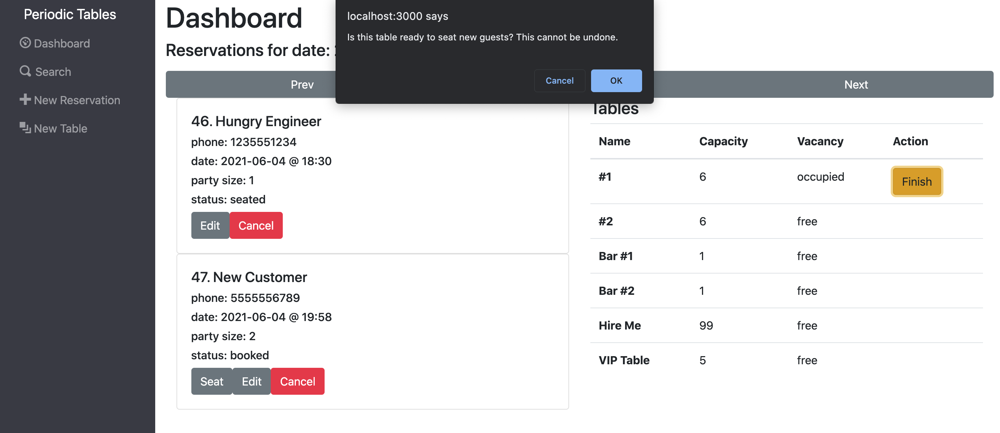

# (Suppr) Reservation Management System

This project is my final project submission for graduation from Thinkful's Engineering Immersion program. It is a browser-based management system created with restaurant managers in mind as the intended users. It is built upon the PERN stack and leverages Express, React, PostgresSQL, React, Knex, Node and Bootstrap.<br>

<br><br>  
# Installation Instructions

  

In order to install and use this application locally, you will need to either clone the repo from this [GitHub](https://github.com/elersong/suppr) or download the zip. You will then need to navigate to the top level of the project in your bash terminal and:

  

1. run `npm i`

2.  `cd front-end && npm i`

3.  `cd ../back-end && npm i`

  

Once all dependencies have been installed, you will need two different PostgreSQL database instances to either run the application locally or test it.

  

You must make a `.env` file in both the front-end and back-end directories.

  

Load the back-end `.env` file with two environment variables with the values of your two database URLs like so:

  

```

DATABASE_URL_DEVELOPMENT=development-data-base-url-goes-here

DATABASE_URL_TEST=test-data-base-url-goes-here

```

  

In the front-end `.env` file, enter:

  

```

REACT_APP_API_BASE_URL=http://localhost:5000

```

  

Now you will need to migrate the tables to the development database. You won't need to migrate any other tables, because the tests are carrying that out for you each time. From the back-end folder:

  

1.  `npx knex migrate:latest`

2.  `npx knex seed:run`

  

Now you are ready to run the server locally. From the top level of the project, run `npm run start:dev` if you would like to run the server and application. Running the same command from either the front or back end directories will start those applications in isolation.

  

If you would like to test the application, you can view the `package.json` files and use the testing scripts provided there. The scripts to look for are structured as follows:

1.  `test:5:backend` or `test:3:frontend`

2.  `test:frontend` or `test:backend`


<br><br>

# Public Endpoints

  

## `/reservations`
<hr>

### GET: `?date=YYYY-MM-DD`

Returns a collection of reservations from the database for the specified date.

### GET: `?mobile_number={some-number}`

Returns a list of reservations that at least partially match the number query.

<i>Shape of response.data from both requests above:</i>

```

[

  {

    reservation_id: 42,

    first_name: "Zaphod",

    last_name: "Beeblebrox",

    mobile_number: "555-555-1234",

    reservation_date: "2099-06-09",

    reservation_time: "06:30:00",

    people: 200,

    status: "booked"

  },

  {

    reservation_id: 7,

    first_name: "Douglas",

    last_name: "Adams",

    mobile_number: "333-555-4444",

    reservation_date: "1980-02-15",

    reservation_time: "04:00:00",

    people: 4,

    status: "booked"

  }

]

```

  

### POST

  

A request body is needed for this route. The body of your request should look like this:

  

```

request: {

    body: {

      data: {

        first_name: "Slarti",

        last_name: "Bartfast",

        mobile_number: "123-555-4567",

        reservation_date: "2126-07-14",

        reservation_time: "10:45:00",

        people: 7,

        status: "booked"

      }

    }

}

```

  

<i>Note: </i> Any requests that send data to the server will pass through extensive validation. Error messages have been written to describe any problems to future developers, but these are the expectations for acceptable data.<br>

- `first_name` and `last_name` must only be strings.

- The `mobile_number` must contain exclusively numeric characters.

- `reservation_date` must be in the format (YYYY-MM-DD) and represent a date of either current day or a future date.

- The `reservation_time` must be in 24H (HH:MM:SS) format. Also, if the date property is on today's date, the time must not have passed on that day when the request is made.

- `people` must be an integer greater than 0.

  

Returns status `201` and the created reservation object.
<br><br>

  

## `/reservations/:reservation_id`
<hr>

### GET

  

If the reservation defined in the request URL exists, it returns the reservation object.

  

```

{

  reservation_id: 7,

  first_name: "Douglas",

  last_name: "Adams",

  mobile_number: "333-555-4444",

  reservation_date: "1980-02-15",

  reservation_time: "04:00:00",

  people: 4,

  status: "booked"

}

```

  

### PUT

  

A request body is needed. The body of the request should conform to:

  

```

data: {

  first_name: "Douglas",

  last_name: "Adams",

  mobile_number: "333-555-4444",

  reservation_date: "1980-02-15",

  reservation_time: "04:00:00",

  people: 4,

  status: "booked"

}

```

  

Returns status `200` and the updated reservation's new data.
<br><br>

  

## `/reservations/:reservation_id/status`

  

<hr>

  

### PUT

  

The body of the request should have this format:

  

```

data: { status: "cancelled" }

```

  

Returns status `200` and the updated reservation object.

<br><br>

  

## `/tables`

  

<hr>

  

### GET

  

Returns a list of all tables in the database.

  

```

[

  {

    table_id: 55,

    table_name: "Bar at the End of the Universe",

    capacity: 400,

    reservation_id: null

  },

  {

    table_id: 42,

    table_name: "VIP Table: Big Think",

    capacity: 1,

    reservation_id: 99

  },

  ...

]

```

  

### POST

  

Body of the request must resemble:

  

```

data : {

  table_name: "Don't Panic",

  capacity: 19,

  reservation_id: 79

}

```

  

- `table_name` does not require any specific string formats, but it must be a string greater than one character.

- `capacity` must be an integer greater than 0.

- `reservation_id` is optional, but if one is included, it must be the ID of a valid active reservation in order to pass validation.

  

Returns `201` and the created table.

<br><br>

  

## `/tables/:table_id`

  

<hr>

  

### GET

  

Returns the table object with the specified `table_id` if one exists in the db.

Response takes the form:

  

```

data : {

  table_id: 45,

  table_name: "Don't Panic",

  capacity: 19,

  reservation_id: 79

}

```

  

<br><br>

  

## `/tables/:table_id/seat`

  

<hr>

  

### PUT


Assigns a given reservation to the table object with the given `table_id` as long as the following conditions are met:

 - The table with the given `table_id` must already exist.
 - The reservation with the given `reservation_id` must already exist.
 - The table cannot be already occupied by a reservation.
 - The reservation to be assigned can only have a status of `booked`.

  

Request body looks like this:

  

```

data: { reservation_id: 76 }

```

  

When the table object is updated with a `reservation_id`, that relationship represents the reservation being seated at the specified table. Accordingly, the reservation's status will also be updated to reflect its `seated` status.<br>

Returns status `200` and the updated <i>reservation</i> data, not the table data.

  

```

data: {

  reservation_id: 3,

  first_name: "Arthur",

  last_name: "Dent,

  mobile_number: "987-555-6543",

  reservation_date: "2107-02-04",

  reservation_time: "14:30:00",

  people: 2,

  status: "seated"

}

```

  

### DELETE

  
Removes the assigned reservation from a specified table, given that the table is occupied.

  

```

data: {

  reservation_id: 69,

  first_name: "Ford",

  last_name: "Prefect",

  mobile_number: "234-555-6789",

  reservation_date: "2032-09-23",

  reservation_time: "12:00:00",

  people: 3,

  status: "finished"

}

```
Returns status `200` and the updated reservation object associated with the change to the table.

  

<br><br>

  

# React Application Front-End

  
The front-end of this project is built using functional React. It includes a main dashboard, various data-entry forms and a search page. The front-end leverages react hooks and react router to add functionality.
  
<br><br>
## `/dashboard`

  

<hr>

  

By default, the `/dashboard` route displays all tables and the reservations that are schedules for the current date. If a reservation has been completed or canceled, it will not be displayed.

  


  

<br><br>

  

## `/dashboard?date=YYYY-MM-DD`

  

<hr>

  

When `/dashboard` is given a date query in the valid format, the reservations for that date are displayed. No information about the tables will change based on the date query.

  

<br><br>

  

## `/reservations/new`

  

<hr>

  

This route displays a form that allows the user to create a new reservation.

After the reservation is submitted, the React application will go back to the dashboard, loading all reservations for the date of the newly created reservation.

  

### Before

  


  

### After

  


  

<br><br>

  

## `/tables/new`

  

<hr>

  

This route displays a form to allow the user to create a new table for the restaurant. 

After submission, the React application will go back the `/dashboard` at the most recently viewed date. The new table will be displayed in the list of tables.

  

### Before

  


  

### After

  


  

<br><br>

  

## `/reservations/:reservation_id/seat`

  

<hr>

  
This route will display a form to assign the specified `reservation_id` to a selected table. The reservation must be `booked` and the table must not be `occupied`. After submission, both the status of the table and the reservation will be updated, and the interface will display the ability to finish a reservation seating.

  

### Before Seat Button is Clicked

  


  

### Seat Form

  


  

### Hungry Engineer is Seated at Table 1

  


  

### Hungry Engineer is Finished Eating, So the Table can be Cleared

  



  

### Hungry Engineer's Reservation is Removed from Dashboard

  


  

<br><br>

  

## `/search`

  

<hr>

  

The displayed form allows the user to search all pending reservations by phone number. Partial matches are acceptable, and the API will return reservations for such matches. If no results are found, the page displays "No reservations found".

  

### Search Matches Reservation's `mobile_number`

  


  

### No results

  


  

<br><br>

  

# Technologies Used

The PERN stack was used to build this application. The PERN stack includes, but is not limited to: PostgreSQL, Express.js, React.js, Node.js. Twitter Bootstrap 4.5.2 is also used on the frontend.


ElephantSQL PostgreSQL instances are used to store the data. Node.js in conjuction with Knex.js are used to update and interface with the data instances. Express.js version 4 is being used to handle the routing between the requests and the responses.

  
Facebook React.js is used on the frontend to create a responsive, dynamic web application for the user. I am using functional, hook-based React as opposed to its object-oriented counterpart. Throughout the frontend application, many hooks are used to simplify flow and layout of the application. 

  

<br>
